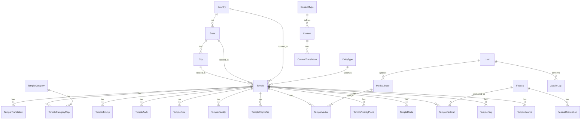

# DevDarshanMarg — Database ER Diagram & Relationships

## Overview

DevDarshanMarg uses PostgreSQL with UUID primary keys, snake_case column mapping, and a **translation pattern** for multilingual content (Gujarati `gu`, Hindi `hi`, English `en`).

---

## ER Diagram (Mermaid)



---

## Table Groups

### 1. Reference Tables

| Table | Purpose | Key Relationships |
|-------|---------|-------------------|
| `deity_types` | Deity classifications (Shiva, Vishnu, etc.) | One deity type → many temples |
| `temple_categories` | Temple categories (Jyotirlinga, Shakti Peeth) | Many-to-many with temples via `temple_category_map` |

### 2. Location Hierarchy

```
Country (1) ──→ (N) State (1) ──→ (N) City (1) ──→ (N) Temple
```

| Relationship | Type | On Delete |
|--------------|------|-----------|
| Country → State | One-to-Many | CASCADE |
| State → City | One-to-Many | CASCADE |
| City/State/Country → Temple | Many-to-One | RESTRICT |

**Why three FKs on Temple?** Direct FKs to country, state, and city enable fast SEO queries (e.g. all temples in Gujarat) without joins through the full hierarchy.

### 3. Temple Core

| Table | Purpose | Relationship |
|-------|---------|--------------|
| `temples` | Language-neutral temple data (slug, coords, contact) | Central hub entity |
| `temple_translations` | Name, description, history, SEO per language | **One temple → up to 3 translations** (unique on `temple_id + language`) |
| `temple_category_map` | Junction table | **Many-to-many**: Temple ↔ TempleCategory |

### 4. Temple Details (One-to-Many from Temple)

All child tables cascade delete when a temple is removed:

| Table | Stores |
|-------|--------|
| `temple_timings` | Daily open/close hours by day of week |
| `temple_aartis` | Aarti schedules with language |
| `temple_rules` | Visitor rules and dress code |
| `temple_facilities` | Parking, prasad, accommodation |
| `temple_pilgrim_tips` | Travel tips for pilgrims |
| `temple_nearby_places` | Attractions near the temple |
| `temple_routes` | How to reach from various cities |
| `temple_faqs` | Frequently asked questions |
| `temple_sources` | Reference links and citations |

### 5. Media

```
User (1) ──→ (N) MediaLibrary (1) ──→ (N) TempleMedia (N) ←── (1) Temple
```

| Table | Purpose |
|-------|---------|
| `media_library` | Central file store; `storage_type` = `local` now, `s3` later |
| `temple_media` | Links media to temples with role (cover, gallery) |

### 6. Festivals

| Table | Relationship |
|-------|--------------|
| `festivals` | Master festival entity with slug |
| `festival_translations` | Multilingual name/description (unique on `festival_id + language`) |
| `temple_festivals` | **Many-to-many**: which temples celebrate which festivals |

### 7. SEO

| Table | Purpose |
|-------|---------|
| `seo_redirects` | URL redirects (301/302) for old URLs |
| `seo_landing_pages` | Programmatic SEO landing pages by slug + language |

**Indexes:** `from_path` (redirects), `slug` + `language` (landing pages)

### 8. Users & Audit

| Table | Relationship |
|-------|--------------|
| `users` | Admin panel users with roles (admin, editor, viewer) |
| `activity_logs` | Audit trail; optional user FK, indexed by entity type/id |

### 9. Content Center

```
ContentType (1) ──→ (N) Content (1) ──→ (N) ContentTranslation
```

For articles, guides, spiritual knowledge — separate from temple-specific content.

---

## Multilingual Pattern

Translation tables share this structure:

```
Master Entity (slug, coords, flags)
    └── Translation (language, name, description, meta_title, meta_description)
        UNIQUE(entity_id, language)
```

**Used in:** `temple_translations`, `festival_translations`, `content_translations`

Language-specific child rows (rules, FAQs, tips) store `language` directly on each row for simpler CRUD.

---

## SEO Indexes Summary

| Table | Indexed Columns | Why |
|-------|-----------------|-----|
| `temples` | `slug`, `country_id+state_id+city_id`, `is_active+is_featured` | URL routing, location pages, featured lists |
| `temple_translations` | `name`, `language` | Search and language filtering |
| `festivals` | `slug`, `month` | Festival pages and calendar |
| `contents` | `slug`, `status` | Published content lookup |
| `seo_redirects` | `from_path` | Fast redirect resolution |
| `seo_landing_pages` | `slug`, `language+is_active` | Landing page routing |

---

## Scaling Notes

1. **UUID PKs** — Safe for distributed writes and public API exposure
2. **Slug uniqueness** — Human-readable URLs for SEO
3. **Storage abstraction** — `media_library.storage_type` supports S3 migration
4. **Activity logs** — Partition by `created_at` when volume grows
5. **View counts** — `temples.view_count` for popularity without analytics dependency
